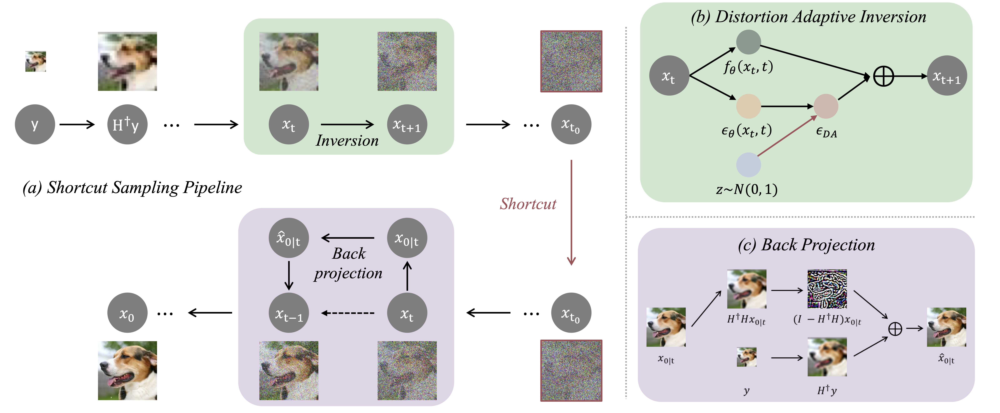

# SSD: Accelerating Diffusion Models for Inverse Problems through Shortcut Sampling
Official implementation of IJCAI 2024 paper [Accelerating Diffusion Models for Inverse Problems through Shortcut Sampling](https://arxiv.org/abs/2305.16965)



TL;DR: We propose Shortcut Sampling for Diffusion (SSD), a novel pipeline for solving inverse problems in a zero-shot manner. Compared to state-of-the-art
zero-shot methods, our method achieves competitive results with only 30 NFEs.

## 📖 Showcases


[//]: # (![img.png]&#40;FID_vs_NFEs/img.png&#41;)


## Getting Started

### 1. Clone the repository

```bash
git clone https://github.com/GongyeLiu/SSD.git
cd SSD
```

### 2. Install dependencies

```bash
pip install -r requirements.txt
```

### 3. Download pretrained models
👉 For face images, we use VE-SDE, which is pre-trained on CelebA, Pretrained Model files can be downloaded from [here](https://drive.google.com/file/d/1wSoA5fm_d6JBZk4RZ1SzWLMgev4WqH21/view?usp=share_link) provided by [SDEdit](https://github.com/ermongroup/SDEdit)

👉 For nature images, we use guided-diffusion, which is pre-trained on ImageNet, Pretrained Model files can be downloaded from [here](https://openaipublic.blob.core.windows.net/diffusion/jul-2021/256x256_diffusion_uncond.pt) provided by [guided-diffusion](https://github.com/openai/guided-diffusion)

The pretrained model files can be put in the `./pretrained_ckpt/` folder.

### 4. Inference

🐬 Run below command to inference on the face images.

```bash
export CUDA_VISIBLE_DEVICES=0
# 4x SR
python inference_ir.py --exp_name celeba_sr_bicubic_4
# 8x SR
python inference_ir.py --def_factor 8. --exp_name celeba_sr_bicubic_8
# colorization
python inference_ir.py --degradation colorization --insert_step 750 --noise_eta 0.8 --exp_name celeba_colorization
# deblur
python inference_ir.py --degradation deblur_gauss --exp_name celeba_deblur
```

Results can be found in `./data_demo/restored_results/`.

## Settings
Details of parameters are provided as follows:

* `forward_timestep`: The number of forward(inversion) steps in the diffusion process.
* `backward_timestep`: The number of backward(generation) steps in the diffusion process.
* `insert_step`: Shortcut time-step t0 in diffusion.
* `stop_consistency_timestep`: Stop using consistency time-step(only for SSD+).
* `noise_eta`: Proportion of added disturbance. (default: `0.8` for colorization, `0.4` for other tasks).
* `degradation`: Degradation type. Available options: `deblur_gauss`, `colorization`, `sr_bicubic`, `sr_average`.
* `deg_factor`: Scale factor of degradation.
* `exp_name`: Experiment name.
* `cfg_path`: Path of config file. (`./configs/inference/celeba_256.yaml` for face images, `./configs/inference/imagenet_256.yaml` for nature images).
* `save_dir`: Path of output folder.
* `save_process`: Whether to save the process images (default: `False`).

## Reproduce our results in the paper

### 1. Download datasets

We follow the datasets settings of [DDNM](https://drive.google.com/drive/folders/1cSCTaBtnL7OIKXT4SVME88Vtk4uDd_u4?usp=sharing). Thanks for their contributions!

One can download the CelebA testset `celeba_hq.zip` and ImageNet testset `imagenet.zip` only, and modify the `gt_root` in the config file (`./configs/inference/celeba_256.yaml`, `./configs/inference/imagenet_256.yaml`) to the path of the downloaded dataset.

### 2. Inference
run below command to reproduce our results.

```bash
bash run/infer_celeba_100.sh
bash run/infer_imagenet_100.sh
bash run/infer_celeba_30.sh
bash run/infer_imagenet_30.sh
```

### 3. Evaluate (Optional)
We use PSNR, SSIM, FID and LPIPS to evaluate the results. If you have problems in Image Quality Assessment, we offer a reference code in [here](https://github.com/GongyeLiu/IQA-Assistant).


## Citation


If you find this repo useful for your research, please consider citing the paper

```
@article{liu2023accelerating,
  title={Accelerating Diffusion Models for Inverse Problems through Shortcut Sampling},
  author={Gongye Liu and Haoze Sun and Jiayi Li and Fei Yin and Yujiu Yang},
  journal={arXiv preprint arXiv:2305.16965},
  year={2023}
}
```

This repo is based on :

* https://github.com/wyhuai/DDNM
* https://github.com/ermongroup/SDEdit
* https://github.com/openai/guided-diffusion
* https://github.com/google/prompt-to-prompt

Thanks for their contributions!


